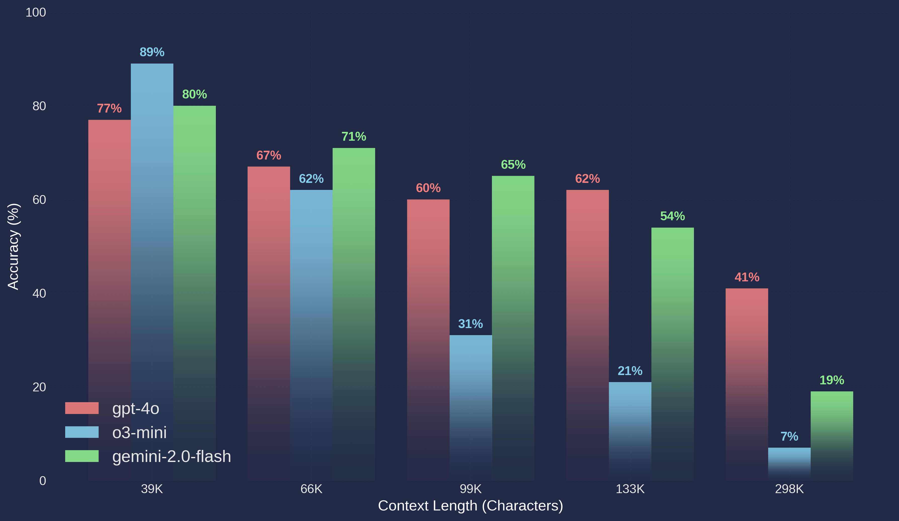

# comprehension-bench

This is a tool for evaluating the performance of large language models on the [MK1 Comprehension Benchmark](TODO).

# Benchmark Results

## Example Usage

`python eval.py --generation_model "gemini-2.0-flash" --generation_backend "google" --generation_api_key $GOOGLE_API_KEY --evaluation_api_key $OPENAI_API_KEY`

The `--num_samples` flag is optional. Set this to a small number (e.g. 5) to evaluate a small subset of the dataset, or leave it unset to evaluate the entire dataset.

## License
The code repository is licensed under the [MIT License](LICENSE).
